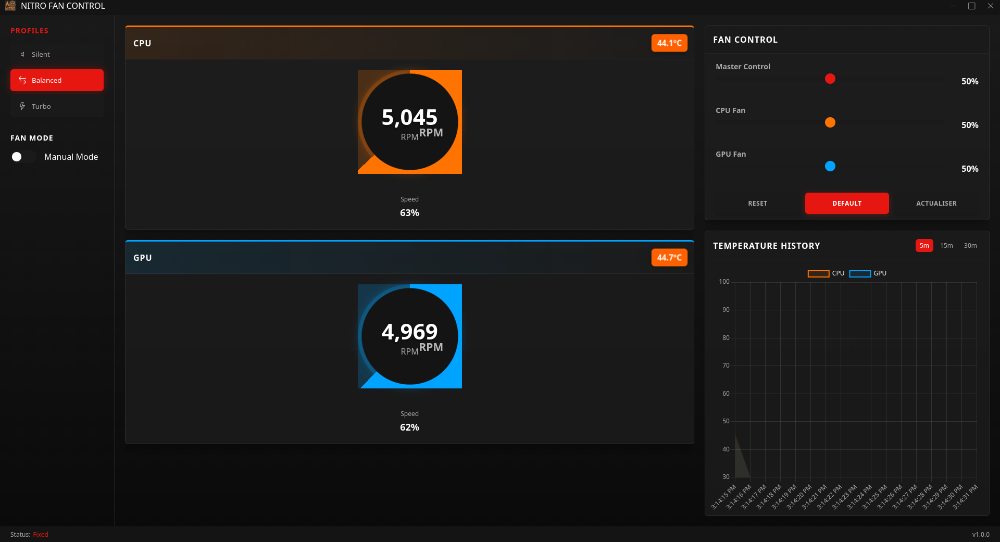

# Nitro Fan Control

<p align="center">
  
</p>

<p align="center">
  <b>A sleek and modern desktop application to monitor and control fan speeds on Acer Nitro laptops.</b>
</p>

<p align="center">
    
    
    
    
</p>

<p align="center">
  <a href="#features">Features</a> •
  <a href="#installation">Installation</a> •
  <a href="#usage">Usage</a> •
  <a href="#license">License</a>
</p>

---

## Features

- **Real-time Monitoring**: Live tracking of CPU & GPU temperatures and fan RPM.
- **Modern UI**: An intuitive and visually appealing interface built with Electron.
- **Fan Control Modes**: 
    - **Auto Mode**: Dynamically adjusts fan speed based on system load.
    - **Manual Mode**: Take full control of your CPU and GPU fans.
    - **Profiles**: Pre-configured profiles for Silent, Balanced, and Turbo performance.
- **Temperature History**: Visualize temperature trends with a built-in chart.

## Installation

This application is a graphical frontend and requires a backend service to control the fans. We recommend using **NoteBook FanControl (NBFC)**.

### 1. Backend Setup (NBFC)

You need to install and configure NBFC for your specific laptop model.

**On Arch Linux (Recommended):**

You can install NBFC from the Arch User Repository (AUR). Using an AUR helper like `yay`:

```bash
yay -S nbfc
```

After installation, you need to enable and start the NBFC service:

```bash
sudo systemctl enable nbfc --now
```

**Find and Apply Your Model Config:**

NBFC requires a configuration file that matches your laptop model.

1.  List available configs: `nbfc config -l`
2.  Find a config that matches your Acer Nitro model (e.g., "Acer Nitro 5 AN515-54").
3.  Apply the config: `nbfc config -a "Your Model Name"`

For other Linux distributions, please follow the official [NBFC-Linux guide](https://github.com/nbfc-linux/nbfc-linux).

### 2. Frontend Setup (This App)

Once the backend service is running, you can set up this Electron application.

1.  **Clone the repository:**
    ```bash
    git clone https://github.com/keizenx/nitro-fan-control.git
    cd nitro-fan-control
    ```

2.  **Install dependencies:**
    ```bash
    npm install
    ```

3.  **Run the application:**
    ```bash
    npm start
    ```

## Usage

- **Profiles**: Select between `Silent`, `Balanced`, and `Turbo` for preset fan curves.
- **Fan Mode**:
    - **Manual Mode**: Allows you to set a fixed percentage for fan speeds using the sliders. The master slider controls both fans, while individual sliders offer fine-grained control.
    - **Auto Mode**: Lets the NBFC service manage fan speeds automatically. The sliders will be disabled.
- **Graph**: The temperature graph displays the history for the last 5, 15, or 30 minutes.
- **Refresh**: The refresh button re-fetches the latest data from the fan service.

## License

This project is licensed under the MIT License - see the [LICENSE](LICENSE) file for details.